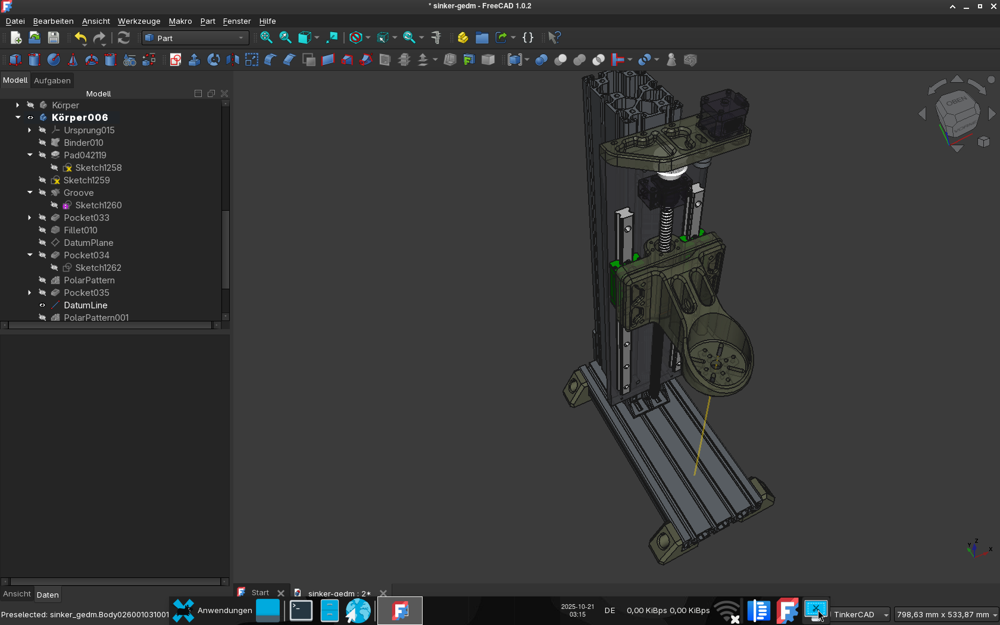
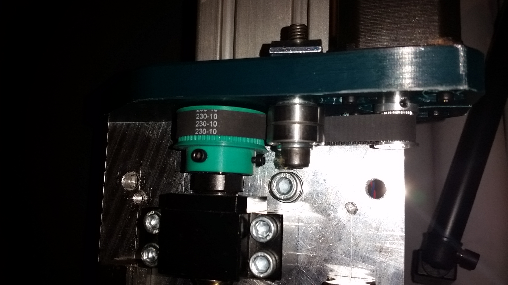

# Basic Sinker EDM Tower
 
 
Beltsize: 
 
GT2, 10mm width, 230T
 
 
Pulleys:
 
1x GT2 60T 10mm bore, 10mm belt width
1x GT2 20T 5mm bore, 10mm belt width
 
 
Motor: 
 
Bipolar (4 wire) 1.68A Nema17
 
 
Linear rails: 
 
HGR20 with one block per side
 
 
Ballscrew:  
SFU1605 without nut housing
 
 
# Printing
  
All parts are printed with 100 infill and normal support touching buildplate.
10-20mm Brim is recommended to prevent warping.
The screws for the ballscrew nut housing are just heated up really heavy with a small blowtorch and then pressed in.
The pocket for the nut may require some postprocessing. I took a batch of sandpaper and rolled it up and then pushed it 
into the pocket and gave it a long sanding until the nut slides in easily without any tension.
If there is tension and the slide does not move easily heating the slide up heavily until the flanges deform against
the HGR Blocks will remove the tension. The slide on my build moves very smooth.
I heated thing up multiple times and the ballscrew nut slit into the pocket with a tiny bit of play after sanding.
 

 

